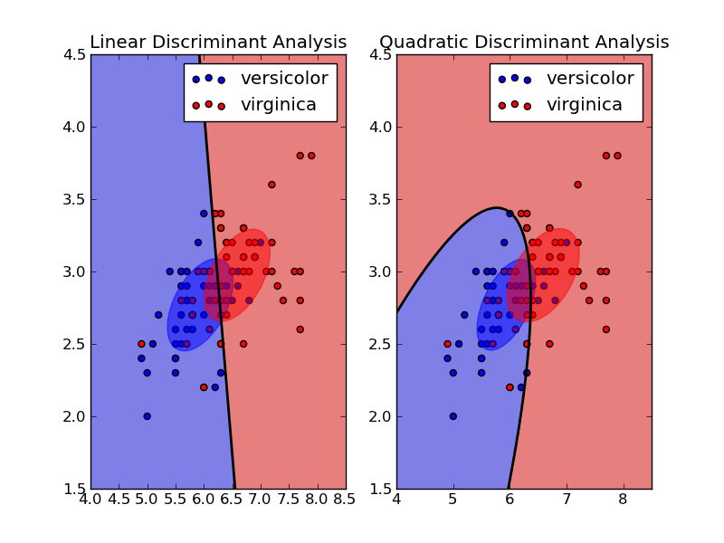

```{r setup, include=FALSE}
knitr::opts_chunk$set(echo = TRUE, message = FALSE,
                      warning = FALSE)
```

#### Using Classification Machine Learning Models and Economic Indicators to Predict Recessions in Africa

#### by Jacob Hembree

# Introduction


## Africa and its Rapid Growth

Africa is an incredibly diverse continent with a vast variety of different cultures, each having rich heritages shaped by thousands of years of history and tradition. The continent's 54 countries and 2 independent states have over 2000 languages that span them! The current population of Africa's \~1.5 billion people makes up 17.89% of the world population. In recent years, Africa has seen rapid population growth, growing 26.9% in the past decade. This growth is expected to continue, and the UN estimates that by 2100, Africa will account for 38% of the world's population. Furthermore, the rapid growth that Africa is experiencing is not limited to population. Africa's economic growth in terms of GDP in recent years has been outpacing the rest of the world. Also, over 60% of Africans are under the age of 25. This demographic makeup coupled with decreasing mortality rates is expected to push economic growth to even greater levels.

While these factors may spur strong economic growth for Africa, growth does not necessarily mean that all people are doing well. In fact, Africa has a staggering income inequality issue, and poverty is a critical issue in the region. Africa accounts for a large share of the world's people living in absolute poverty. Close to 50% of people living in Sub-Saharan Africa live on less than \$1 (USD) per day. This translates into significant difficulties accessing basic needs such as food, housing, healthcare, and education. Furthermore, in times of recession, these challenges for the poor are exacerbated drastically.


## Project Motivation

Recessions are significant periods of economic decline marked by slowed economic growth, decreased consumer spending, and rising unemployment. Recessions are typically recognized by a fall in a country's Gross Domestic Product (GDP) for two consequetive quarters. Recessions can create hardships for the countries, especially for lower and middle class people. Furthermore, with the poverty issues discussed above, Africa faces significant challenges, come recession. Additionally, with the rapid population growth, lots of people's lives will be at stake. Thus, we seek to predict recessions using a variety of economic indicators in order to give countries adequate time to prepare for financial hardships that come with recession. Poverty is no joke and having time to prepare for significant financial hardships could mean the difference between life and death. In this project, we seek to answer the following questions: What economic indicators are most significant for predicting recessions and can we accurately predict recessions without direct economic growth data?

## Introducing the Data Set

The African Country Recession Dataset is a Kaggle dataset that includes 49 predictors and one binary outcome variable `recession`. This dataset provides a variety of economic indicators comprised from data from University of Groningen, Bank of Canada, and the World Bank. The data tracks values for these indicators for a variety of African nations from 2000 to 2017. The countries included are Morocco, South Africa, Tanzania, Rwanda, Eswatini, Togo, Burkina Faso, Angola, Tunisia, Nigeria, Kenya, Burundi, Benin, Namibia, Central African Republic, Sudan, Gabon, Niger, Sierra Leone, Lesotho, Mauritania, Senegal, Mauritius, Botswana, Cameroon, Zimbabwe, and Mozambique. In our project, we will use some of the most significant economic variables in order to predict the outcome variable `recession`. We will start by loading necessary packages and reading in our dataset.

```{r}
# Load packages for future use
library(tidymodels)
library(tidyverse)
library(dplyr)
library(corrplot)
library(ggplot2)
library(discrim)
library(ranger)
library(yardstick)


full_recession_data <-  read.csv("data/africa_recession.csv")

dim(full_recession_data)
```

Our initial data set has the anticipated 50 variables and 486 samples. We do not need to keep all 49 predictors since many of the predictors included in the original data store some of the same information. We will go about refining the data down to around 20 variables keeping the most significant indicators of economic performance and financial stability.

## Condensing the Data

In a separate R script, we selected some of the most useful information for determining the economic activity and well-being of a nation. Our final data set has been limited to 17 variables — 16 predictors and our binary `recession` variable which will be our predicted output. The following variables in the data set are:

-   `population` - Population (in millions).

-   `emp_to_pop` - Ratio of employed people to total population.

-   `hci` - Human capital index, based on average years of schooling and returns from that education.

-   `consumption_hg` - Real consumption of households and government at current PPPs.

-   `absorption` - Real domestic absorption (Consumption plus Investment) at current PPPs.

-   `tfp` - Total Factor Productivity (TFP), an equation measuring the impact of technological advancements and changes in worker knowledge.

-   `labor_share` - Share of labor compensation of the current GDP.

-   `irr` - Real internal rate of return.

-   `depreciation` - Average depreciation rate of capital stock (Machines, etc that produce consumer goods).

-   `exchange` - Current exchange rate of the nation currency to USD.

-   `share_house` - The share of GDP from household consumption at current PPPs.

-   `share_gov` - The share of GDP from government consumption at current PPPs.

-   `share_exports` - The share of GDP from exports at current PPPs.

-   `share_imports` - The share of GDP from imports at current PPPs.

-   `cpi` - Commodity price index (CPI), measuring the cost of a broad range of goods.

-   `cpi_change` - Year-over-year change in CPI

-   `recession` - outcome variable: "1" if Recession, "0" if not.

(Note: when "current PPPs" are used, this refers to the current purchasing power in 2011 USD).

```{r}
# Load in project data
project_data <- read.csv("data/project_data.csv")

# Remove number column "X"
project_data <- project_data %>%
  select(-X)

# Change outcome variable recession to a factor variable
project_data$recession <- as.factor(project_data$recession)

# Check dimensions
dim(project_data)
```

We see that we were able to properly load in our refined data set with our expected 17 variables and 486 samples.

## Checking Missing Data

We check to see how many data values are missing from the set so we can manage them accordingly.

```{r}
# Check total missing data
num_missing_vals <- sum(is.na(project_data))
num_missing_vals
```

We see that the data set has no missing values, and thus we do not need to address potential issues with missing data.


# Exploratory Data Analysis

We start by observing some trends in our data by conducting an exploratory data analysis.

## Correlation of the Predictors

We begin by inspecting the correlative trends of our predictors using a Correlation plot.

```{r}
#Correlation Plot
# Remove outcome variable
predictors <- project_data %>%
  select(-recession)

# Compute the correlation matrix
corr_mat <- cor(predictors, use = "complete.obs")

#Create the Correlation plot
corrplot(corr_mat, method = "circle", type = "upper", tl.cex = 0.8)
```

We see that there are some strong correlations between population and consumption/absorption. This makes sense since adding more people directly leads to greater consumption. We observe that household consumption share of GDP is negatively correlated with exports share of GDP. This implies that there is a trade-off between goods being consumed domestically versus being exported abroad. Furthermore, there is a negative correlation between labor share of GDP and exports share, implying that countries with greater exports pay their workers worse as a percentage of GDP. We also observe a significantly negative correlation between TFP and the employment to population ratio. This suggests that populations with greater amounts of employed persons in the region have worse productivity and technological advances. Lastly, we notice that the CPI change and CPI are mostly uncorrelated with the other variables.

## Distribution of the Outcome Variable

Next, we will create a bar plot to display the distribution of the outcome variable, recession.

```{r}
#Barplot of Recession
ggplot(project_data, aes(x = recession)) +
  geom_bar() +
  labs(title = "Bar Plot of Recession Variable",
       x = "Recession",
       y = "Count") +
  theme_minimal()
```

We see that the distribution of the outcome variable is heavily skewed towards countries not being in recession. This makes sense as Africa has been experiencing prominent growth, and countries are generally not in recession regardless. Using stratification on the recession variable, we can ensure that both the training and testing sets have an adequate spread of data from each type despite this differential.

## Distribution of Internal Rate of Return

Now, we will plot the distribution of the internal rate of return in a histogram to get a sense of the economic performance of these countries.

```{r}
#Histagram of IRR
ggplot(project_data, aes(x = irr)) +
  geom_histogram(binwidth = 0.05, fill = "blue", color = "black", alpha = 0.7) +
  labs(title = "Histogram of Internal Rate of Return",
       x = "IRR",
       y = "Frequency") +
  theme_minimal()
```

We see that the majority of the internal rate of returns are concentrated around 10% annually. There are also a substantial number in the surrounding groups of about 15% and 5%. Furthermore, there is a small tail of values extending towards 50%. In essence, we observe the appearance of a left-ward skewed Gaussian distribution centered around 10%.

## How Internal Rate of Return Affects Recessions

Now, we will combine the internal rate of returns in a box plot with the recession variable so we can analyze their relationship.

```{r}
# Box Plot of IRR and recession
ggplot(project_data, aes(x = recession, y = irr)) +
  geom_boxplot(fill = "lightblue", color = "black") +
  labs(title = "Box Plot of IRR by Recession",
       x = "Recession",
       y = "IRR") +
  theme_minimal()
```

We see that there is a larger variance on the 1 side likely because there are fewer samples. Overall, we do not see any substantial differences when taking this variance into account. We see that both means are centered around 10%, with the 1 side being slightly lower. This plot suggests that the internal rate of return may not have a substantial effect on the presence of recessions in the data set.

## Distribution of the CPI Changes

Next, we want to observe the status of inflation in the region. The yearly change in the CPI is effectively how inflation is measured, and thus we can get a sense of the inflation in the region. We plot the distribution of the CPI changes in a histogram.

```{r}
#Histagram of CPI Changes
ggplot(project_data, aes(x = cpi_change)) +
  geom_histogram(binwidth = 0.05, fill = "green", color = "black", alpha = 1.0) +
  labs(title = "Histogram of CPI Changes",
       x = "Year-over-year CPI change",
       y = "Frequency") +
  theme_minimal()
```

We see that the distribution of CPI change is concentrated into a few chunks around -0.3, 0, and 0.2. These different positions on the histogram represent vastly different economic situations. The group on the far left corresponds to significant deflation when price levels are rapidly decreasing. The data that is concentrated around 0 represents stable changes to price level. These either represent slight, manageable inflation or slight deflation. Lastly, the group near 0.2 represents significant inflation that rapidly raises prices of goods. Thus, we observe from the histogram that a significant percentage of CPI changes are either extreme inflation or deflation. This indicates that there is frequent instability in price levels in Africa which could contribute to overall economic instability.

## How Inflation Affects Recessions

Now, we combine the CPI change data with the outcome variable to see how inflation impacts the presence of recessions in Africa.

```{r}
# Box plot of Recession and CPI Change
ggplot(project_data, aes(x = recession, y = cpi_change)) +
  geom_boxplot(fill = "lightblue", color = "black") +
  labs(title = "Box Plot of CPI Change by Recession",
       x = "Recession",
       y = "CPI Change") +
  theme_minimal()
```

We observe that the column indicating recession has a significantly higher average CPI change. This implies that larger CPI increases (higher inflation) contributes to the presence of recessions. This relationship makes sense since high inflation hurts consumers' purchasing power leading to difficulties affording goods. This indirectly lowers consumption which can lead to recessions.

# Model Preparation

Now that we have broadly explored some of our data, we will go about setting up the models to predict recessions.

## Splitting the Data

First, we must split our data into training and testing sets. This split ensures that when we go to test our models, we are testing on data that the models have not seen. This allows for generality to new data rather than just reading the data set given. Furthermore, splitting allows us to tune individual hyperparameters and select models with cross validation, which we will be doing later on. When conducting our split, we make sure to stratify on the outcome variable, `recession`. Stratification ensures that both the training and testing splits will have a sufficient number of each level of recession (0 and 1).

```{r}
# Split data stratifying on recession
set.seed(123) # Setting seed for reproducibility
split <- initial_split(project_data, prop = 0.8, strata = recession)

# Split the data
recession_train <- training(split)
recession_test <- testing(split)

# Display the dimensions of the splits
cat("Training set dimensions: ", dim(recession_train), "\n")
cat("Testing set dimensions: ", dim(recession_test), "\n")

```

The training and testing splits are created, and they have an adequate split of the data. We chose to split the data so 80% is in the training set and 20% is in the testing set. Since we have a small data set in terms of samples, we give our training set a large proportion of the data so it has sufficient information to train on.

## Building the Recipe

Now that we have conducted a split of our data, we will go about creating a recipe that will be used for all of our models. Our recipe will include all of the predictors, thus allowing them all to play a part in determining if a recession is present. Our recipe will also involve centering and scaling all the predictors so the models can equally weight the predictors when determining their impact on the outcome variable.

```{r}
# Recipe with all predictors
recession_recipe <- recipe(recession ~ ., data = recession_train) %>%
  #Center and scale all predictors
  step_center(all_predictors()) %>%
  step_scale(all_predictors())
  
```

## K-Fold Cross Validation

K-fold cross validation is a resampling technique that allows us to test a model's performance and ability to generalize to different data sets. Using this method, we divide the data set into 10 different folds in order to perform cross-validation stratified on our outcome variable, `recession`.

```{r}
# Create k = 10 folds
recession_folds <- vfold_cv(recession_train, v = 10, strata = recession)
```

Now that we have split the data, built our recipe, and obtained our folds, we can move on to building our models! Because model building can be computationally intensive and time-consuming, we will be saving our models to RDA files so they can be easily re-loaded whenever. We save our folds, recipe, and training and testing sets to an RDA for later use.

```{r}
save(recession_folds, recession_recipe, recession_train, recession_test, file = "RDA/Model_Prep.rda")
```

# Building the Models

The model making process follows a similar scheme for all models. For the models logistic regression, LDA, and QDA, tuning cannot be performed on hyperparameters, so we avoid steps 3-5. However, for decision tree and random forest models, we will tune the hyperparameters in order to get the most optimal model. We will use the following process to make our models:

1.  We first set up the model. This involves setting the engine to our desired model and setting the mode (either regression or classification). For all of our models, we will set mode to classification.

2.  Next we set up the workflow by adding the new model and our established recipe.

3.  For the decision tree and random forest, we prepare to tune the hyperparameters by setting up a tuning grid. We set the ranges of the hyperparameters to a reasonable range of possibilities.

4.  We then tune the model with the ranges of different hyperparameters.

5.  After our models have finished tuning, we finalize our workflow with the optimized hyperparameters.

6.  We then fit that model with our workflow to our entire training dataset.

7.  Finally, we will save our results to an RDA file for sake of easy reloading into the main document.

## Performance Metric - Area Under ROC Curve


We will be using the area under the Receiver Operator Characteristic curve (ROC_AUC) as a metric to determine the optimal performance of the models on the testing set. ROC_AUC functions as a good aggregate measure of a model's ability to discern between positive and negative classes. The ROC curve plots the true positivity rate over the false positive rate at various thresholds. The area under this curve quantifies the model's ability to classify the positive or negative instances of the outcome variable. An area under the curve of 0.5 implies that the model performs just as well as a coin toss at predicting the outcome, whereas an area of 1 implies that the model predicts perfectly. We are striving for a larger area under the curve indicating that our models have some accuracy in prediction.

# Model Results

We followed our procedure above to create the models. We load in our finished models from their RDA files so we can assess their performance.

```{r}
load("RDA/Log_Reg.rda")
load("RDA/LDA.rda")
load("RDA/QDA.rda")
load("RDA/Decision_Tree.rda")
load("RDA/Random_Forest.rda")
```

## Discriminant Analysis Models



Discriminant analysis models work by finding linear combinations of predictor variables that best separate the classes. The two main types of discriminant analyses are Linear Discriminant Analysis (LDA) and Quadratic Discriminant Analysis (QDA). We will be applying both of these models to the training set. LDA assumes that the predictor variables are normally distributed and that different classes have a common covariance matrix, resulting in linear decision boundaries. On the other hand, QDA allows for each class to have its own covariance matrix, resulting in quadratic decision boundaries. Both methods estimate the parameters of the distributions for each class and then use these parameters to calculate the probability that a given observation belongs to each class. The observation is then classified into the class with the highest probability. Of these two models, LDA is the more inflexible model due to its assumption of the normal distribution among the predictor variables. QDA is more flexible in giving each predictor its own covariance matrix. This results in the less-rigid quadratic boundaries.

### Linear Discriminant Analysis

We plot the ROC curve for our application of LDA to the training set to get a sense of its performance.

```{r}
lda_roc %>%
  roc_curve(recession, .pred_0) %>%
  autoplot()
```

We see that the ROC curve for LDA demonstrates a solid performance on the training set. This is relatively surprising since the LDA model is inflexible with its normality assumptions on the predictors.

### Quadratic Discriminant Analysis

We then plot the ROC curve for our QDA model's prediction of the training set.

```{r}
qda_roc %>%
  roc_curve(recession, .pred_0) %>%
  autoplot()
```

We see that the increased flexibility in QDA results in a greater performance as far as area under the ROC curve. QDA demonstrates very strong performance at predicting the outcome variable, `recession`. The area under the ROC curve is well over 0.9 and thus the QDA model could be a strong choice for modeling recessions in Africa with our data.

## Logistic Regression


Logistic regression is a classification model used to predict binary outcome variables. Unlike linear regression, which predicts a continuous outcome, logistic regression models the probability that a given input belongs to a particular class. It accomplishes this by applying the logistic function to a linear combination of the input features, producing an output between 0 and 1. This output can be interpreted as the probability of the positive class. Logistic regression estimates the coefficients of the predictors through maximum likelihood estimation, aiming to find the set of parameters that best fits the observed data.

We plot the ROC curve from our logistic regression model to get a sense of its ability to predict on the training set.

```{r}
log_reg_roc %>%
  roc_curve(recession, .pred_0) %>%
  autoplot()
```

We see that the logistic regression model performs well in terms of area under the ROC curve. The ROC curve demonstrates that the model can predict on the training set with a solid level of reliability.

## Decision Tree


Decision trees are models used in classification and regression that work by recursively splitting the data into subsets based on the most significant feature at each node, thus creating a tree-like structure of decisions. Each internal node represents a decision based on a feature, each branch represents the outcome of that decision, and each leaf node represents a final output or class label. In this model, we will tune the hyperparameter complexity. Tuning complexity in decision tree models refers to controlling the model's depth and structure to prevent overfitting or underfitting.

We use autoplot() to display the different \`roc_auc\`\` values in tuning the complexity hyperparameter.

```{r}
autoplot(dt_tune_res)
```

We see that lower complexity parameters around 0.001 - 0.01 perform the best for the decision tree model. Unfortunately, this ROC curve demonstrates that the optimal decision tree model still is not very effective at predicting the `recession` outcome variable.

## Random Forest


The random forest model is an ensemble learning model used for classification and regression tasks. Random forests combine multiple decision trees to create a more robust and accurate model. This model then aggregates the performance of these decision trees to improve accuracy and control overfitting. Each tree in the forest is built from a random subset of the training data, and at each split in the tree, a random subset of features is considered. This randomness helps ensure that the model is robust and generalizes well to new data. We will be tuning the hyperparameters of `mtry`, `trees`, and `min_n`. Tuning `mtry` means adjusting the number of features included at each split in the trees. Furthermore, tuning `trees` alters the total number of decision trees, and tuning `min_n` alters the minimum number of samples to split a node. We autoplot the tuning process for the model.

We use autoplot() to view the tuning of these 3 hyperparameters over 8 levels.

```{r}
autoplot(rf_tune_res)
```

We see that models with more trees generally perform better, which makes sense as they take in a greater amount of information to train the model. We also observe that, generally, as the number of randomly selected predictors increases, it is accompanied by a loss in area under the ROC curve. We see that a lot of the minimal node sizes produce similar results in terms of area under the curve.

# Model Comparison

Now that we have created our models, we will assess their performance at predicting the entire training set against one another using area under the ROC curve as our metric.

```{r}
log_reg_auc <- augment(log_reg_fit, new_data = recession_train) %>%
  roc_auc(recession, .pred_0) %>%
  select(.estimate)

lda_auc <- augment(lda_fit, new_data = recession_train) %>%
  roc_auc(recession, .pred_0) %>%
  select(.estimate)

qda_auc <- augment(qda_fit, new_data = recession_train) %>%
  roc_auc(recession, .pred_0) %>%
  select(.estimate)

dt_auc <- augment(dt_final_fit, new_data = recession_train) %>%
  roc_auc(recession, .pred_0) %>%
  select(.estimate)

rf_auc <- augment(rf_final_fit, new_data = recession_train) %>%
  roc_auc(recession, .pred_0) %>%
  select(.estimate)

recession_roc_auc <- c(log_reg_auc$.estimate,
                      lda_auc$.estimate,
                      qda_auc$.estimate,
                      dt_auc$.estimate,
                      rf_auc$.estimate)

model_names <- c("Logistic Regression",
                 "LDA",
                 "QDA",
                 "Decision Tree",
                 "Random Forest")

model_results <- tibble(Model = model_names, ROC_AUC = recession_roc_auc)

model_results <- model_results %>%
  dplyr::arrange(-recession_roc_auc)

model_results
```

We observe that our best performing models are the Random Forest and the Quadratic Discriminant Analysis. Surprisingly, our random forest model had an area under the ROC curve of 1, indicating that it was perfect at predicting the training set. Furthermore, our next strongest model, QDA, had an `roc_auc` of 0.958. This means that QDA also did an exceptional job predicting the training set. The other models of logistic regression, LDA, and decision tree, yield moderate performance with `roc_auc` in the 0.8's.

# Evaluation on Testing Set

To assess the performance and the models' ability to generalize to new data, we test our best two models (random forest and QDA) on the testing set.

```{r}
test_rf_roc_auc <- augment(rf_final_fit, new_data = recession_test, type = 'prob') %>%
  roc_auc(recession, .pred_0) %>%
  select(.estimate)

test_rf_roc_auc
```

The random forest model's area under the ROC curve when predicting the testing set was 0.809. This is a very strong performance! We see that our random forest model can predict recessions with the economic data with accuracy significantly better than a coin toss.

```{r}
test_qda_roc_auc <- augment(qda_fit, new_data = recession_test, type = 'prob') %>%
  roc_auc(recession, .pred_0) %>%
  select(.estimate)

test_qda_roc_auc
```

The QDA model's area under the ROC curve when predicting the testing set was 0.622. While this is significantly worse than the random forest model, it is still demonstrates a moderate performance predicting recessions in the new data.


# Conclusions

Throughout this project, we have explored various economic indicators in the context of predicting recessions in Africa. In this process, we split our data, built and tuned a variety of models, and applied our two most optimal models to our testing set. We gained some valuable insights into the model-making process of logistic regression, discriminate analyses, and tree-based models.

The two best performing models at predicting our training set, random forest and QDA, had vastly different performances when predicting the testing set. Our best model, random forest, had an area under the ROC curve of 0.809. This indicates that the random forest model is solid at predicting recessions in Africa given our set of predictors. Furthermore, this shows that the random forest model can effectively generalize to new data and still make accurate predictions. On the other hand, our QDA model had an ROC curve of only 0.622. This sharp difference from 0.958 when predicting the training set indicates that there was likely some overfitting present that contributed to the high `roc_auc`. Thus, the model shows poor prediction performance only somewhat better than a coin flip. We observe that the random forest was the far superior model when applied to the testing set.

For further research regarding this information, we can use our optimal random forest model to try and predict current day recessions using our set of predictors. We may also look to modify this model to include new predictors that may allow for greater prediction accuracy. Furthermore, we can apply these models to a wider range of economic data for other regions to try and generalize our recession modeling beyond Africa. Hence, we can potentially build upon this research and create a model that can predict recessions in a general setting.

# References

Chirin. (2019). *African Country Recession Dataset (2000 to 2017).* Kaggle. <https://www.kaggle.com/datasets/chirin/african-country-recession-dataset-2000-to-2017>

Luvaga, E. (2020, December 29). *Can Africa as a whole become an economic superpower?*. Department of Economics. <https://www.econ.iastate.edu/ask-an-economist/can-africa-whole-become-economic-superpower>

Ritchie, H., & Roser, M. (2024, February 5). *More than 8 out of 10 people in the world will live in Asia or Africa by 2100*. Our World in Data. <https://ourworldindata.org/region-population-2100#article-citation>
